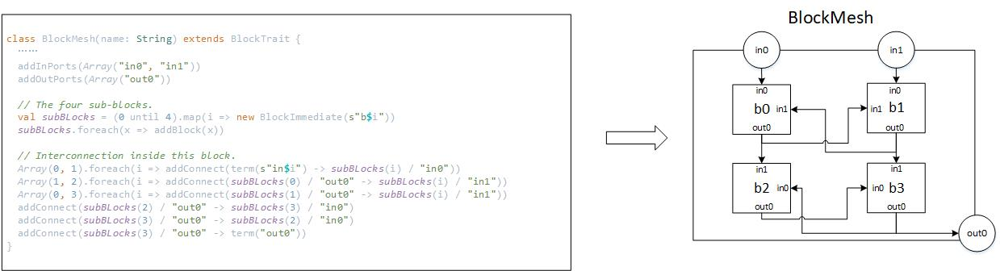

Pillars: A Consistent CGRA Design Framework
=====================
Pillars is an open-source CGRA design framework with
consistency to assist in design space exploration and hardware
optimization of CGRAs. Pillars provides a Scala-based architecture
description language (ADL) for an architect to specify
a CGRA architecture, which produces a unified, high-quality
and synthesizable architectural abstraction. Auxiliary hardware
modules and Verilog RTL are automatically generated
according to the architectural abstraction, allowing physical
implementation on an FPGA as an overlay. An integer linear
programming (ILP) CAD tool can map data-flow graph (DFG)
onto the specified CGRA, generating contexts for CGRA RTL level
simulation.


## Installing Necessary Dependencies

|  Package  |  Version  |
|  :----: | :----: |
| Java  | ≥ 8.0 |
| [Scala](https://www.scala-lang.org/download/)  | ≥ 2.12.10 |
| [Chisel](https://github.com/freechipsproject/chisel3)  | ≥ 3.2.2 |
| [Gurobi](https://www.gurobi.com/)  | ≥ 8.1.1 |
| [Verilator](https://www.veripool.org/wiki/verilator)  | ≥ 3.916 |

### Installing Scala
Install Scala either by installing an IDE such as IntelliJ, or sbt, Scala's build tool.
You can install sbt in Ubuntu using following command:
 ```Bash
 echo "deb https://dl.bintray.com/sbt/debian /" | sudo tee -a /etc/apt/sources.list.d/sbt.list
 curl -sL "https://keyserver.ubuntu.com/pks/lookup?op=get&search=0x2EE0EA64E40A89B84B2DF73499E82A75642AC823" | sudo apt-key add
 sudo apt-get update
 sudo apt-get install sbt
 ```

It may take a few minutes.

### Installing Chisel
Chisel will be installed automatically according to build.sbt the first time you run sbt.

### Installing Gurobi

Go to [Gurobi website](https://www.gurobi.com/) to register and request an academic license, and download the Gurobi library.
In bin subdirectory of Gurobi directory, please run 
```Bash
./grbgetkey <key-you-obtained>
``` 
to activate your Gurobi, detailed in [Gurobi installation guide](https://www.gurobi.com/documentation/9.0/quickstart_linux/software_installation_guid.html#section:Installation).

After Gurobi is activated, please run
```Bash
mkdir lib
ln $GUROBI_HOME/linux64/lib/gurobi.jar lib/
``` 
in this directory to use the Gurobi library in this project.

### Installing Verilator

To install Verilator as a package:
``` shell
sudo apt-get install verilator
``` 

## Project Tree

```
.
├── app-mapping-results             //some pre-generated mapping results
├── build.sbt                       //the library dependencies in sbt
├── doc                             //documents of APIs in Pillars
├── dfg                             //some DFGs in DOT format
├── fig                             //some figures in README
├── Makefile                        
├── mrrg                            //some MRRGs
├── README.md 
├── scalastyle-config.xml           //the scalastyle file
├── scalastyle-test-config.xml      //the scalastyle file
└── src
    └── main
        └── scala
            └── tetriski
                └── pillars
                    ├── archlib     //the library of elements and blocks
                    ├── core        //the core of Pillars
                    ├── examples    //some examples showing how to use Pillars
                    ├── hardware    //hardware implemented in Chisel
                    ├── mapping     //mapping tools
                    ├── Pillars.scala
                    ├── testers     //testers in Pillars
                    └── util        //utiliy for realizing hardware
```


## Quick Start

### Running Tests

To test some existing applications and different CGRA architectures, run:
``` shell
make build
make run
``` 


If everything is setup correctly, all tests will be passed.

### Running End2end Tutorial

You can study the end2end tutorial in the examples subdirectory.
To test it, run
``` shell
make end2end
``` 

### Mapping

Users can map a DFG onto MRRG with our ILP mapper (tetriski.pillars.mapping.ILPMap.mapping).

``` Java
object ILPMap {
  /** Map given DFG(IR) to given MRRG,
   * and write result to file which name is related to filename using FileWriter fw.
   *
   * @example If the file name is "dir/test", this mapper will produce "dir/test_i.txt" (Information TXT)
   *          and "dir/test_r.txt" (Result TXT) when mapping is successful.
   * @param dfg             the given DFG
   * @param mrrg            the given MRRG
   * @param filename        the name we will used to write result
   * @param fw              the FileWriter we used
   * @param separatedPR     a parameter indicating whether ILP placement and routing should be separated
   * @param scheduleControl a parameter indicating whether the latency and skew should be controlled and obtained in ILP
   * @param skewLimit       the limit of skew which only is used when latencyControl is ture
   * @param latencyLimit    the limit of latency which only is used when latencyControl is ture
   * @return the run time of mapper
   */
  def mapping(dfg: DFG, mrrg: MRRG, filename: String = null, fw: FileWriter = null,
              separatedPR: Boolean = false, scheduleControl: Boolean = false,
              skewLimit: Int = 2, latencyLimit: Int = 32): Double = {
        ...
        }
    ...
    }
``` 

### Designing CGRA Architectures

You can design your own CGRA architectures by create blocks like what in the archlib subdirectory.

Examples:




Note: If you want to add or modify a basic module, you can design your own elements and basic chisel modules.
Do not forget to keep the modeling consistency and runtime consistency as mentioned in annotation.


### Simulation

As shown in following codes,
a few templates and tools in Pillars are useful to construct the simulation processes 
and produce classes in the specific format of Chisel testers using the Verilator backend.

``` Java
/** A tester for matrix multiplication.
 *
 * @param c             the top design
 * @param appTestHelper the class which is helpful when creating testers
 */
class MatrixMulTester(c: TopModule, appTestHelper: AppTestHelper)
  extends ApplicationTester(c, appTestHelper) {

  poke(c.io.en, 0)
  inputData()
  val testII = appTestHelper.getTestII()
  inputConfig(testII)
  poke(c.io.en, 1)
  checkPortOutsWithInput(testII)

}
``` 

Users can also use
 ``` shell
 gtkwave test_run_dir/YOUR_ELABORATING_RESULT/TopModule.vcd
 ``` 
 to view simulating waveform.
 
### Synthesis (Under Development)
 
 Pillars also allows users to employ CGRA as virtual overlay 
 to produce high-quality custom hardware, which is called "soft-CGRA".
 Some tested synthesized hardware can significantly
  reduce the resource usages compared with HLS. 
  
## Publications

For more detailed information and paper reference, please refer to the following papers:
`Yijiang Guo and Guojie Luo, "Pillars: An Integrated CGRA Design Framework," Third Workshop on Open-Source EDA Technology (WOSET), November 2020.`
```
@article{guo-pillars-woset2020,
  title   = "{Pillars: An Integrated CGRA Design Framework}",
  author  = {Yijiang Guo and Guojie Luo},
  journal = {Third Workshop on Open-Source EDA Technology (WOSET)},
  month   = {November},
  year    = {2020},
} 
```

`Yijiang Guo, Jiarui Wang, Jiaxi Zhang and Guojie Luo, 
"Formulating Data-arrival Synchronizers in Integer Linear Programming for CGRA Mapping",
58th Design Automation Conference (DAC), December 2021.`
```
@article{guo-formulating-dac2021,
  title   = "{Formulating Data-arrival Synchronizers in Integer Linear Programming for CGRA Mapping}",
  author  = {Yijiang Guo and Jiarui Wang and Jiaxi Zhang and Guojie Luo},
  journal = {58th Design Automation Conference (DAC)},
  month   = {December},
  year    = {2021},
} 
```
